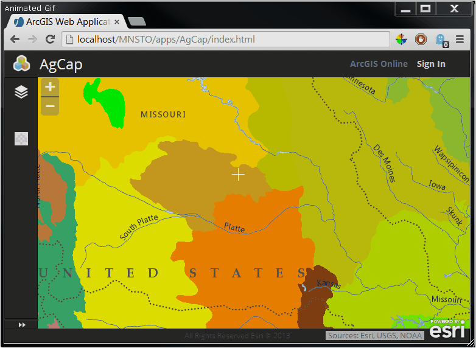

Map Navigation History
======================

#### Overview
Uses dojo/router to enable zooming to next or previous extent using the browser forward and back buttons. The geographic map center and map zoom level is placed on the url.



#### WAB Config
Include the following code on the "preloadedWidgets" property of the WAB config:
```json
{
"uri": "widgets/MapNavigationHistory/Widget",
"name": "MapNavigationHistory",
"label": "Map Navigation History"
}
```

#### Use
WABAppUrl.com/index.html#/_longitude_/_latitude_/_zoomLevel_

The application will automatically update the route on pan and zoom. Users may also manually edit the route to go to a specific long, lat, and zoom level. A user can bookmark the url in the browser and, on load, the app will zoom and pan to the bookmarked location.
